# Shipex

Shipex by using flutter.

## Packages we are using:
- cgoogle_maps_flutter: '0.5.33' [link]https://pub.dev/packages/google_maps_flutter/versions/0.5.33)
- flutter_polyline_points: ^0.0.1 [link](https://pub.dev/packages/flutter_polyline_points/versions/0.0.1)

My Animation app contains a total of 5-screen, the welcome screen where a user choose Login or SignUp when go to HomeScreen.

### Animation App Final UI

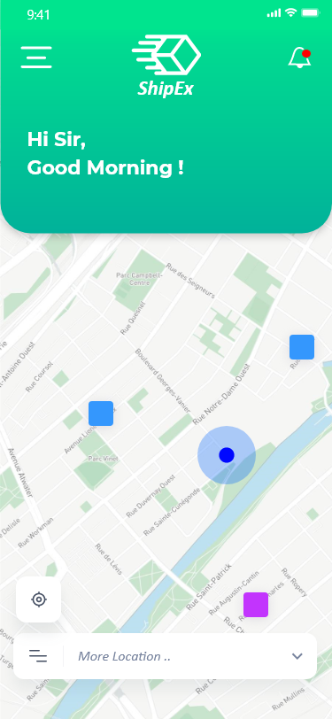
  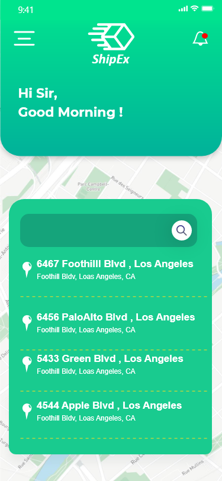
  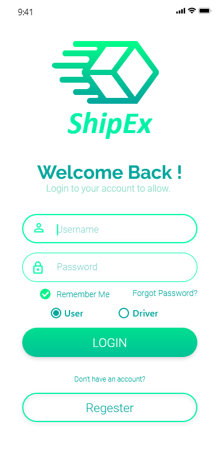
  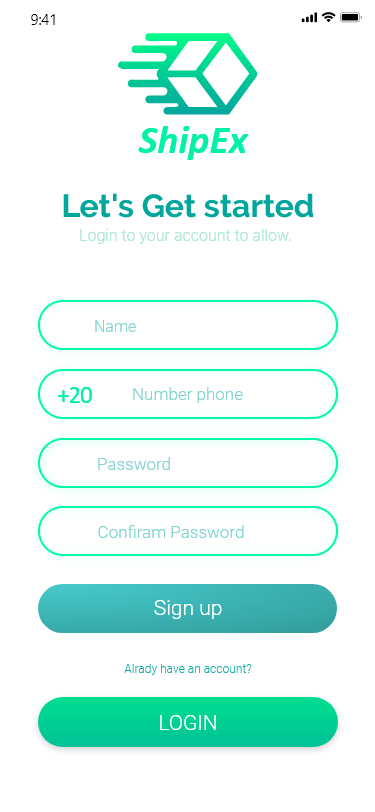
  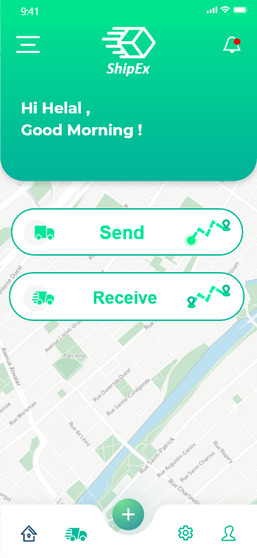
  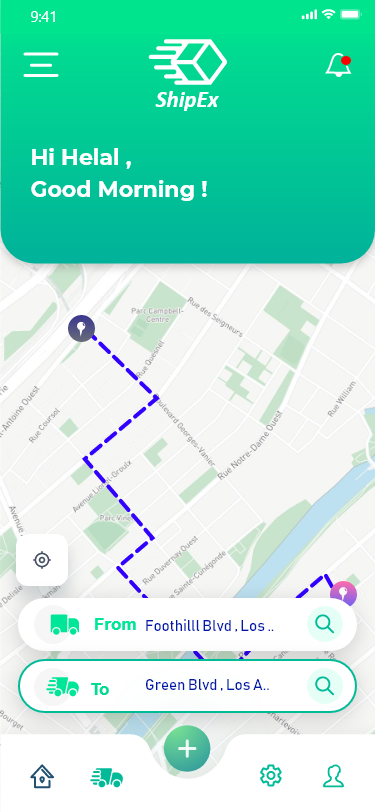
  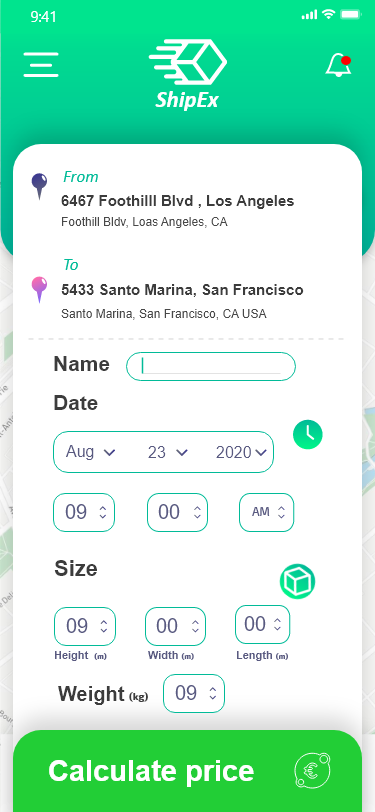
  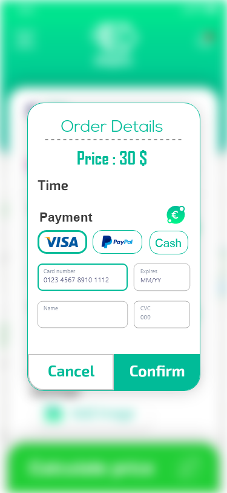
  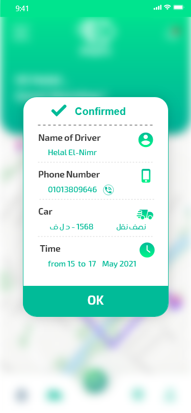
  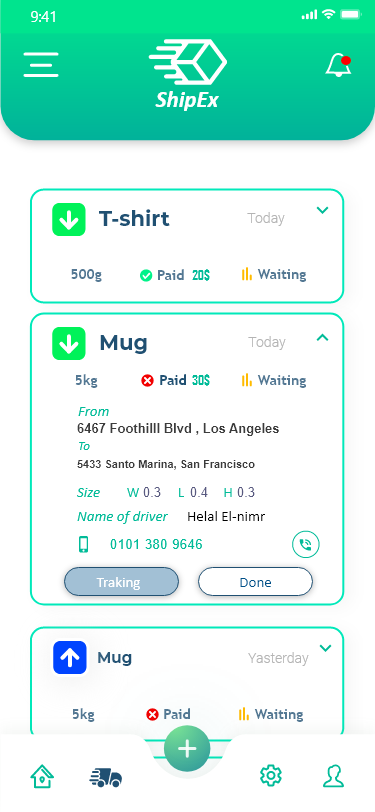
  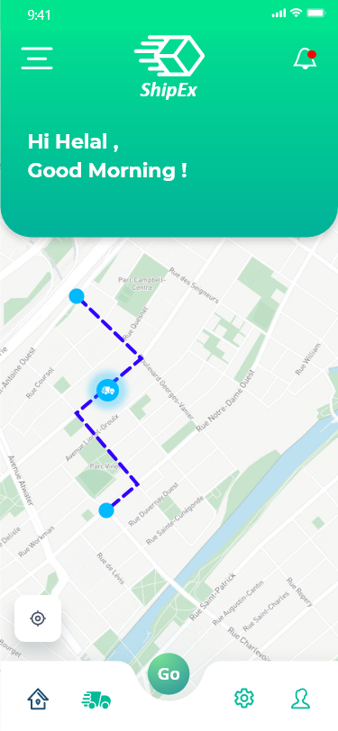
  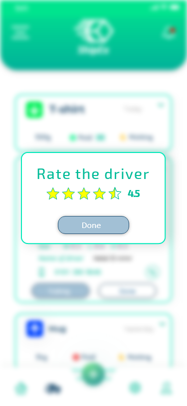
  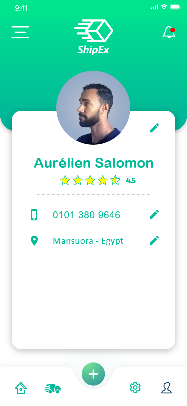
  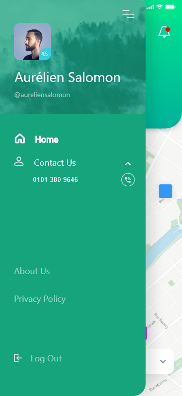

